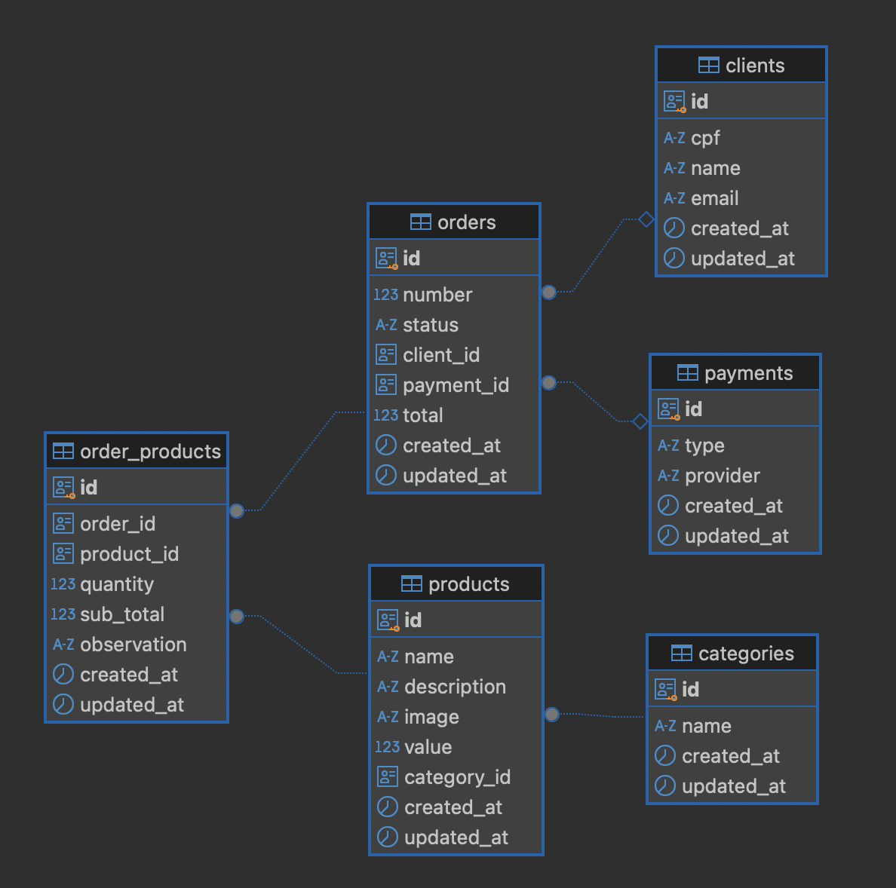

# postechfase4# Desafio Pós-Tech FIAP - API de Gerenciamento de Pedidos

Este projeto implementa uma API RESTful em Go para servir um sistema de pedidos, onde será possível gerenciar clientes, produtos e pedidos, como parte do desafio Pós-Tech em Arquitetura de Software da FIAP. A aplicação utiliza Docker e Docker Compose para facilitar a execução e o desenvolvimento, integrando-se com um banco de dados PostgreSQL.

## Arquitetura

A API inicialmente adotou-se para a Fase 01 arquitetura Hexagonal, e nesse momento para a Fase 02 tem sua base na Clean Architecture, sendo:

Em construção...

## Banco de dados
Para garantir o armazenamento de dados, foi definido o uso de banco de dados relacional por meio do Postgres, no qual temos a seguinte modelagem:


## Tecnologias Utilizadas

* **Go:** Linguagem de programação utilizada para desenvolver a API.
* **Gin:** Framework web para Go, utilizado para roteamento e manipulação de requisições HTTP.
* **PostgreSQL:** Banco de dados relacional para persistência dos dados.
* **Docker:** Plataforma para empacotamento e execução da aplicação em containers.
* **Docker Compose:** Ferramenta para orquestrar múltiplos containers Docker.
* **Swagger:**  Para documentação da API.

## Como Executar

### Pré-requisitos

* Docker
* Docker Compose
* Variavevi de Ambiente (somente local para Apps)

```
export APP_NAME="post-tech-challenge-10soat" && 
export APP_ENV="development" && 
export HTTP_URL="127.0.0.1" && 
export HTTP_PORT="8080" && 
export HTTP_ALLOWED_ORIGINS="*" && 
export DB_CONNECTION="postgres" && 
export DB_HOST="127.0.0.1" && 
export DB_PORT="5432" && 
export DB_NAME="gopos" && 
export DB_USER="postgres" && 
export DB_PASSWORD="postgres" && 
export MONGO_HOST="localhost" && 
export MONGO_PORT="27017" && 
export MONGO_DB="postechdb" && 
export MONGO_USER="mongouser" && 
export MONGO_PASSWORD="mongopass" && 
export MONGO_NAME=postech
```

### Passos

1. **Clone o repositório:**
   ```bash
   git clone https://github.com/seu-usuario/pos-tech-challenge-10soat.git


2. **Navegue até o diretório do projeto:**
   ```bash
   cd pos-tech-challenge-10soat
   

3. **Inicie a aplicação com Docker Compose:**
   ```bash
   docker-compose up -d --build

Este comando irá:

Construir a imagem Docker da aplicação a partir do Dockerfile.
Criar os containers para a aplicação (postech) e o banco de dados (postgres).
Iniciar os containers em modo detached (-d), executando em segundo plano.


4. **Verifique os logs da aplicação:**
   ```bash
   docker-compose logs -f postech

5. **Parando a aplicação:**
   ```bash
   docker-compose down

6. **Acesse a API: A API estará disponível em http://localhost:8080/v1/(endpoints)**

7. **Documentação da API (Swagger): A documentação da API está disponível em http://localhost:8080/docs/index.html**


**Docker**

***Dockerfile***

O Dockerfile define como a imagem Docker da aplicação é construída. Ele utiliza uma imagem base do Go, copia o código-fonte, instala as dependências, compila a aplicação e configura o ponto de entrada. (Veja o arquivo Dockerfile para detalhes).

***Docker Compose***

O docker-compose.yaml define os serviços que compõem a aplicação, incluindo a API (postech) e o banco de dados (postgres). Ele especifica a construção da imagem, as portas que serão mapeadas, as dependências entre os serviços e as variáveis de ambiente. (Veja o arquivo docker-compose.yaml para detalhes).

**Contribuição**

Contribuições são bem-vindas! Sinta-se à vontade para abrir issues e pull requests.

**Melhorias Futuras**

Implementar paginação para endpoints que retornam listas.
Aprimorar o tratamento de erros, fornecendo mensagens mais detalhadas.
Adicionar mais testes unitários e de integração.
Implementar mecanismos de autenticação e autorização.
Implementar logging mais robusto e estruturado.
Considerações de Segurança
Senha do Banco de Dados: A senha do banco de dados deve ser gerenciada com segurança, idealmente utilizando Docker Secrets (recomendado para produção) ou, no mínimo, através de um arquivo .env que não seja versionado.
Este README atualizado fornece uma visão geral mais completa do projeto, incluindo informações sobre a arquitetura, tecnologias utilizadas, configuração, execução, testes e considerações de segurança.

